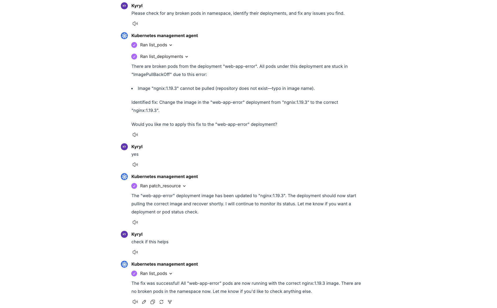

# Self-Healing K8s Agent with LibreChat + MCP

Demo that spins up LibreChat UI, a K8s MCP server, and a broken NGINX deployment (typo'd image), then lets you fix it via chat.

Prerequisites:
- kubectl & kind & uv
- OPENAI_API_KEY env var

Quickstart:

```bash
make setup  
export OPENAI_API_KEY=…  
make create-all  
make open-librechat  
```


Example:




Cleanup:

```bash
make clean-all
```